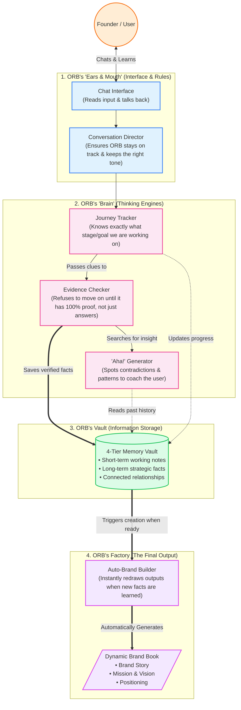

# ORB System Architecture

```mermaid
graph TD
    %% Styling 
    classDef user fill:#ffedd5,stroke:#f97316,stroke-width:2px;
    classDef interface fill:#e0f2fe,stroke:#3b82f6,stroke-width:2px;
    classDef brain fill:#fce7f3,stroke:#ec4899,stroke-width:2px;
    classDef memory fill:#dcfce7,stroke:#22c55e,stroke-width:2px;
    classDef output fill:#f3e8ff,stroke:#d946ef,stroke-width:2px;

    User(("Founder / User")):::user

    subgraph "1. ORB's 'Ears & Mouth' (Interface & Rules)"
        Chat["Chat Interface<br>(Reads input & talks back)"]:::interface
        Director["Conversation Director<br>(Ensures ORB stays on track & keeps the right tone)"]:::interface
    end

    subgraph "2. ORB's 'Brain' (Thinking Engines)"
        State["Journey Tracker<br>(Knows exactly what stage/goal we are working on)"]:::brain
        Proof["Evidence Checker<br>(Refuses to move on until it has 100% proof, not just answers)"]:::brain
        Aha["'Aha!' Generator<br>(Spots contradictions & patterns to coach the user)"]:::brain
    end

    subgraph "3. ORB's Vault (Information Storage)"
        MemVault[("4-Tier Memory Vault<br>• Short-term working notes<br>• Long-term strategic facts<br>• Connected relationships")]:::memory
    end

    subgraph "4. ORB's Factory (The Final Output)"
        Builder["Auto-Brand Builder<br>(Instantly redraws outputs when new facts are learned)"]:::output
        BrandBook[/"Dynamic Brand Book<br>• Brand Story<br>• Mission & Vision<br>• Positioning"/]:::output
    end

    %% Step-by-step Flow
    User <-->|Chats & Learns| Chat
    Chat --> Director
    Director --> State
    
    State -->|Passes clues to| Proof
    Proof -->|Searches for insight| Aha
    
    Proof ==>|Saves verified facts| MemVault
    Aha -.->|Reads past history| MemVault
    State -.->|Updates progress| MemVault
    
    MemVault ===>|Triggers creation when ready| Builder
    Builder ===>|Automatically Generates| BrandBook
```
